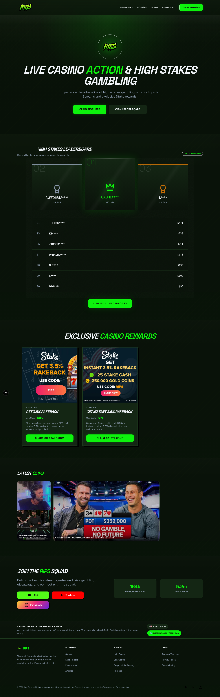
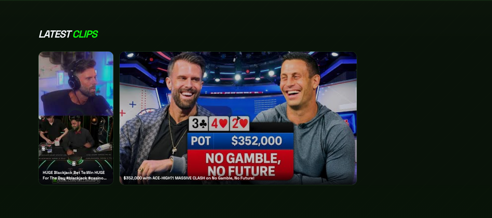
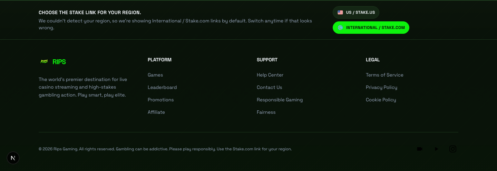

# Rips.win Client Update — March 11, 2026

Hi team — here’s a quick visual recap of the updates completed today.

## Homepage improvements

- Updated the homepage flow so the rewards and clips content now sits more clearly alongside the main public sections.
- Kept the homepage aligned with the latest public content and footer guidance updates.

## Bonuses added to the homepage

- Added the live bonus cards directly to the homepage instead of the empty fallback state.
- Matched the homepage bonuses to the same shared cards and content used on the `/bonuses` page.
- Made each full bonus card clickable for a cleaner desktop and mobile experience.

## Clips section refreshed

- Replaced the previous clips with the two new YouTube videos provided.
- Updated the layout so Shorts display in portrait and standard YouTube videos display in landscape while keeping the section visually consistent.

## Footer market guidance update

- Moved the Stake market guidance into the footer for a less intrusive layout.
- Reworded the copy so it more clearly explains the United States vs. international link choice.
- Added a simple market switcher so visitors can change between `Stake.us` and `Stake.com` if the default looks wrong.

## Summary of today’s completed work

- clearer Stake market guidance
- manual market switcher in the footer
- homepage bonuses now visible
- full-card clickable bonuses
- clips updated to the new videos
- mixed video formats rendering correctly

**Status:** reviewed, tested, shipped, and merged.